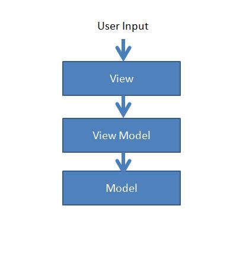
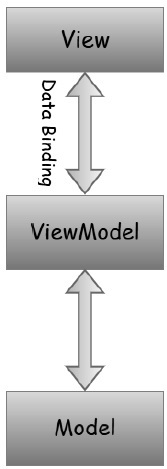
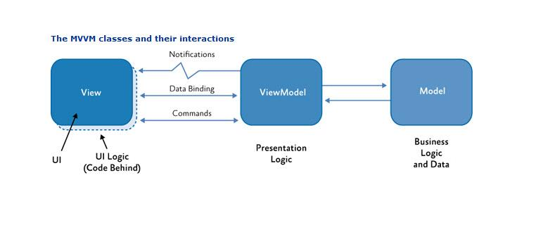
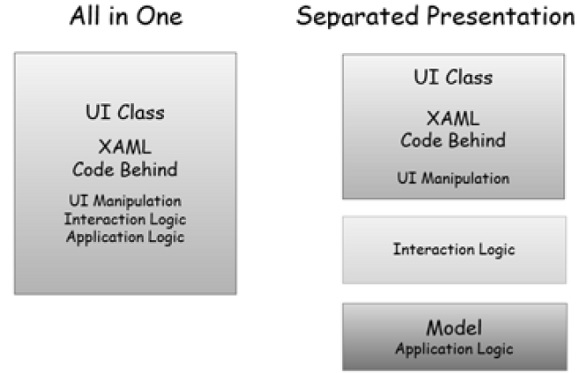
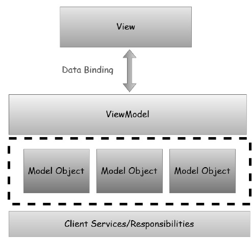

# MVVM Design Pattern

1. [WPF MVVM从入门到精通1：MVVM模式简介](https://blog.csdn.net/lweiyue/article/details/88861896)
2. [MVVM : Multithreading and Dispatching in MVVM Applications](https://docs.microsoft.com/en-us/archive/msdn-magazine/2014/april/mvvm-multithreading-and-dispatching-in-mvvm-applications)
3. [WPF MVVM模式](http://t.zoukankan.com/gaobing-p-3853819.html)
4. [Patterns - WPF Apps With The Model-View-ViewModel Design Pattern](https://docs.microsoft.com/en-us/archive/msdn-magazine/2009/february/patterns-wpf-apps-with-the-model-view-viewmodel-design-pattern)
5. [WPF 一个MVVM的简单例子](https://www.cnblogs.com/linlf03/archive/2011/09/11/2173833.html)
6. [MVVM - Quick Guide](https://www.tutorialspoint.com/mvvm/mvvm_quick_guide.htm)

*************************************

## 0 Introduction

The well-ordered and perhaps the most reusable way to organize your code is 
to use the 'MVVM' pattern. The **Model**, **View**, **ViewModel** 
(**MVVM pattern**) is all about guiding you in how to organize and structure 
your code to write maintainable, testable and extensible applications.

 

MVVM 设计模式基于 MVC 将 UI 和逻辑分离的结构思想。
1. Model：数据访问层 - It simply holds the data and has nothing to do with any 
of the business logic.
2. ViewModel：View 的抽象，并将 View 的 Command 传递到 Model - It acts as the 
link/connection between the Model and View and makes stuff look pretty.
3. View：界面层 - It simply holds the formatted data and essentially delegates 
everything to the Model.

### 0.1 Separated Presentation

To avoid the problems caused by putting application logic in code-behind or 
XAML, it's best to use a technique known as separated presentation. We're 
trying to avoid this, where we will have XAML and code-behind with the minimum 
required for working with user interface objects directly. User interface 
classes also contain code for complex interaction behaviors, application 
logic, and everything else as shown in the following figure on the left side.

- With separated presentation, the user interface class is much simpler. It 
has the XAML of course, but the code behind does as little as is practical.
- The application logic belongs in a separate class, which is often referred 
to as the model.
- However, this is not the whole story. If you stop here, you're likely to 
repeat a very common mistake that will lead you down the path of data 
binding insanity.
- A lot of developers attempt to use data binding to connect elements in 
the XAML directly to properties in the model.
- Now sometimes this can be okay, but often it's not. The problem is the model 
is entirely concerned with matters of what the application does, and not 
with how the user interacts with the application.
- The way in which you present data is often somewhat different from how it's 
structured internally.
- Moreover, most user interfaces have some state that does not belong in the 
application model.
- For example, if your user interface uses a drag and drop, something needs to 
keep track of things like where the item being dragged is right now, how its 
appearance should change as it moves over possible drop targets, and how 
those drop targets might also change as the item is dragged over them.
- This sort of state can get surprisingly complex, and needs to be thoroughly 
tested.
- In practice, you normally want some other class sitting between the user 
interface and the model. This has two important roles.
    - First, it adapts your application model for a particular user interface view.
    - Second, it's where any nontrivial interaction logic lives, and by that, 
    I mean code required to get your user interface to behave in the way you want.

### 0.2 Advantages

采用 MVVM 架构的优点:
1. 将 UI 和业务的设计完全分开
   * View 和 UnitTest 只是 ViewModel 的两个不同形式的消费者
   * 项目可测试性更高，可以执行单元测试
2. 有助于我们区别并哪些是 UI 操作，哪些是业务操作，而不是将他们混淆在 CodeBehind 中
3. 层与层之间耦合度降低, 非常符合面向对象( OOP )的思想。

MVVM pattern is ultimately the modern structure of the MVC pattern, so the 
main goal is still the same to provide a clear separation between domain 
logic and presentation layer. Here are some of the advantages and 
disadvantages of MVVM pattern.

The key benefit is allowing true separation between the View and Model 
beyond achieving separation and the efficiency that you gain from having 
that. What that means in real terms is that when your model needs to change, 
it can be changed easily without the view needing to and vice-versa.

There are three important key things that flow out of applying MVVM which 
are as follows.

**Maintainability**
- A clean separation of different kinds of code should make it easier to go 
into one or several of those more granular and focused parts and make 
changes without worrying.
- That means you can remain agile and keep moving out to new releases quickly.

**Testability**
- With MVVM each piece of code is more granular and if it is implemented 
right your external and internal dependences are in separate pieces of code 
from the parts with the core logic that you would like to test.
- That makes it a lot easier to write unit tests against a core logic.
- Make sure it works right when written and keeps working even when things 
change in maintenance.

**Extensibility**
- It sometimes overlaps with maintainability, because of the clean separation 
boundaries and more granular pieces of code.
- You have a better chance of making any of those parts more reusable.
- It has also the ability to replace or add new pieces of code that do 
similar things into the right places in the architecture.

The obvious purpose of MVVM pattern is abstraction of the View which 
reduces the amount of business logic in code-behind. However, following 
are some other solid advantages ?
- The ViewModel is easier to unit test than code-behind or event-driven code.
- You can test it without awkward UI automation and interaction.
- The presentation layer and the logic is loosely coupled.

### 0.3 Disadvantages

- Some people think that for simple UIs, MVVM can be overkill.
- Similarly in bigger cases, it can be hard to design the ViewModel.
- Debugging would be bit difficult when we have complex data bindings.

## 1 Responsibilities

MVVM pattern consists of three parts ? Model, View, and ViewModel. Most 
of the developers at the start are little confused as to what a Model, 
View and ViewModel should or shouldn't contain and what are the 
responsibilities of each part.

In this chapter we will learn the responsibilities of each part of the 
MVVM pattern so that you can clearly understand what kind of code goes 
where. MVVM is really a layered architecture for the client side as shown 
in the following figure.

- The presentation layer is composed of the views.
- The logical layer are the view models.
- The presentation layer is the combination of the model objects.
- The client services that produce and persist them either directed 
access in a two-tier application or via service calls in and then 
to your application.
- The client services are not officially part of the MVVM pattern but it is 
often used with MVVM to achieve further separations and avoid duplicate code.

### 1.1 Model Responsibilities

In general, model is the simplest one to understand. It is the client side 
data model that supports the views in the application.
- It is composed of objects with properties and some variables to contain 
data in memory.
- Some of those properties may reference other model objects and create the 
object graph which as a whole is the model objects.
- Model objects should raise property change notifications which in WPF means 
data binding.
- The last responsibility is validation which is optional, but you can embed 
the validation information on the model objects by using the WPF data binding 
validation features via interfaces like INotifyDataErrorInfo/IDataErrorInfo

### 1.2 View Responsibilities

The main purpose and responsibilities of views is to define the structure of 
what the user sees on the screen. The structure can contain static and dynamic 
parts.
- Static parts are the XAML hierarchy that defines the controls and layout of 
controls that a view is composed of.
- Dynamic part is like animations or state changes that are defined as part of 
the View.
- The primary goal of MVVM is that there should be no code behind in the view.
- It’s impossible that there is no code behind in view. In view you at least 
need the constructor and a call to initialize component.
- The idea is that the event handling, action and data manipulation logic 
code shouldn’t be in the code behind in View.
- There are also other kinds of code that have to go in the code behind any 
code that's required to have a reference to UI element is inherently view code.

## 2 ViewModel

ViewModel 是 MVVM 架构中最重要的部分，ViewModel 
中包含属性、命令、方法、事件、属性验证等逻辑。

### 1.1 ViewModel 的作用

**ViewModel 的属性**：ViewModel 的属性是 View 数据的来源。这些属性可由三部分组成：
* 一部分是Model的复制属性
* 另一部分用于控制UI状态
* 第三部分是一些方法的参数

**ViewModel 的命令**： 用于接受View的用户输入，并做相应的处理。我们也可以通过方法实现相同的功能。
\
A command whose sole purpose is to relay its functionality to other objects 
by invoking delegates. The default return value for the CanExecute method 
is 'true'.

**ViewModel 的事件**： 主要用来通知 View 做相应的UI变换。

**ViewModel 的方法**： 有些事件是没有直接提供命令调用的，如自定义的事件。
这时候我们可以通过 CallMethodAction 来调用 ViewModel 中的方法来完成相应的操作。

