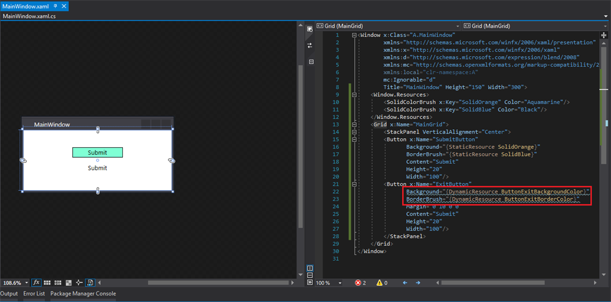
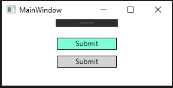

# Static And Dynamic Resources In WPF

<https://www.c-sharpcorner.com/article/static-dynamic-resources-in-wpf/>

- [WPF 入门教程Resources使用方法](https://blog.csdn.net/liaohaiyin/article/details/120249063)
- [WPF中的资源简介、DynamicResource与StaticResource的区别](https://www.cnblogs.com/tianma3798/p/5927335.html)

******************************

## 1 Introduction


### 1.1 What are Resources?


### 1.2 Advantages


## 2 How to declare


### 2.1 Window level resources


### 2.2 Panel level resources


### 2.3 Application-level resources


### 2.4 Resource Dictionary


## 3 How to Use

It's very simple, just use StaticResource or DynamicResource tag, as per the 
application's requirements.

```csharp
    Margin = "{StaticResource MarginTop}"
```

Let's go ahead and create a WPF application.


### 3.1 Static Resource

It will not change once it's assigned and they are applied at the compiled time only.
 
Add 2 static resources, one for button's background & another for the button's border. 

```csharp
<Window x:Class="A.MainWindow"    
        xmlns="http://schemas.microsoft.com/winfx/2006/xaml/presentation"    
        xmlns:x="http://schemas.microsoft.com/winfx/2006/xaml"    
        xmlns:d="http://schemas.microsoft.com/expression/blend/2008"    
        xmlns:mc="http://schemas.openxmlformats.org/markup-compatibility/2006"    
        xmlns:local="clr-namespace:A"    
        mc:Ignorable="d"    
        Title="MainWindow" Height="150" Width="300">    
    <Window.Resources>    
        <SolidColorBrush x:Key="SolidAquamarine" Color="Aquamarine"/>    
        <SolidColorBrush x:Key="SolidBlack" Color="Black"/>    
    </Window.Resources>    
    <Grid x:Name="MainGrid">    
        <Button x:Name="SubmitButton"    
               Background="{StaticResource SolidAquamarine}"    
               BorderBrush="{StaticResource SolidBlack}"    
               Content="Submit"    
               Height="20"    
               Width="100"/>    
    </Grid>    
</Window>     
```


As you can see, the .NET framework does not wait until code execution, you can 
see changes at compile-time only.


### 3.2 Dynamic Resource

It will change even after its being used. The concept is the same as data 
binding in WPF if the value of the bound property is changed.

So is the value on UI.

Change XAML as follows: added a new button.

```csharp
<Window x:Class="A.MainWindow"    
        xmlns="http://schemas.microsoft.com/winfx/2006/xaml/presentation"    
        xmlns:x="http://schemas.microsoft.com/winfx/2006/xaml"    
        xmlns:d="http://schemas.microsoft.com/expression/blend/2008"    
        xmlns:mc="http://schemas.openxmlformats.org/markup-compatibility/2006"    
        xmlns:local="clr-namespace:A"    
        mc:Ignorable="d"    
        Title="MainWindow" Height="150" Width="300">    
    <Window.Resources>    
        <SolidColorBrush x:Key="SolidAquamarine" Color="Aquamarine"/>    
        <SolidColorBrush x:Key="SolidBlack" Color="Black"/>    
    </Window.Resources>    
    <Grid x:Name="MainGrid">    
        <StackPanel VerticalAlignment="Center">    
        <Button x:Name="SubmitButton"    
               Background="{StaticResource SolidAquamarine}"    
               BorderBrush="{StaticResource SolidBlack}"    
               Content="Submit"    
               Height="20"    
               Width="100"/>    
        <Button x:Name="ExitButton"    
               Background="{DynamicResource ButtonExitBackgroundColor}"    
               BorderBrush="{DynamicResource ButtonExitBorderColor}"    
               Margin="0 10 0 0"    
               Content="Submit"    
               Height="20"    
               Width="100"/>    
        </StackPanel>    
    </Grid>    
</Window>    
```

Also, add 2 resources in the code behind.

```csharp
using System.Drawing;  
using System.Windows;  
using System.Windows.Media;  
  
namespace A  
{  
    /// <summary>  
    /// Interaction logic for MainWindow.xaml  
    /// </summary>  
    public partial class MainWindow : Window  
    {  
        public MainWindow()  
        {  
            InitializeComponent();  
            this.DataContext = new MainWindowViewModel();  
            this.Resources["ButtonExitBackgroundColor"] = new SolidColorBrush(Colors.LightGray);  
            this.Resources["ButtonExitBorderColor"] = new SolidColorBrush(Colors.Black);  
        }  
    }  
}  
```



Now, have a look. Color is not applied on the 2nd button at compile-time, as 
the .NET framework resolves it at runtime.

Now run the project to see the magic.



Hurray! Color has been applied on the 2nd button as expected.

You can define DynamicResource in XAML as well, but it will resolve at runtime only.

```csharp
<StackPanel VerticalAlignment="Center">    
       <Button x:Name="SubmitButton"    
              Background="{StaticResource SolidAquamarine}"    
              BorderBrush="{StaticResource SolidBlack}"    
              Content="Submit"    
              Height="20"    
              Width="100"/>    
       <Button x:Name="ExitButton"    
              Background="{DynamicResource SolidAquamarine}"    
              BorderBrush="{DynamicResource SolidBlack}"    
              Margin="0 10 0 0"    
              Content="Submit"    
              Height="20"    
              Width="100"/>    
</StackPanel>     
```

I hope this article has cleared your confusion between static and dynamic 
resources in WPF.
 
Please apply them to achieve reusability in your projects.
 
Happy Coding!
 
If you have any queries, feel free to connect with me @

- [github](https://github.com/RikamPalkar)
