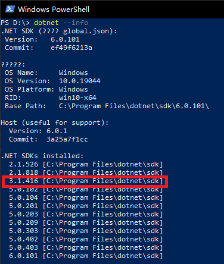
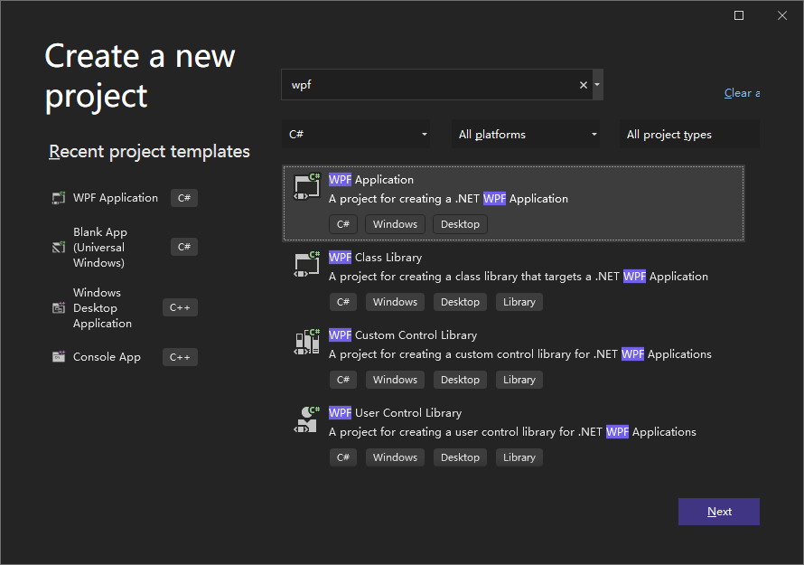
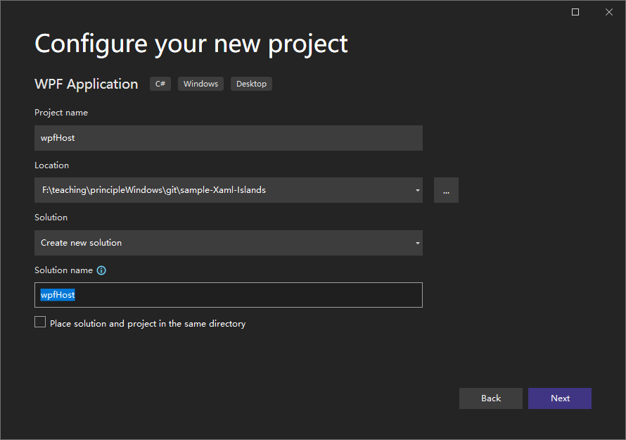
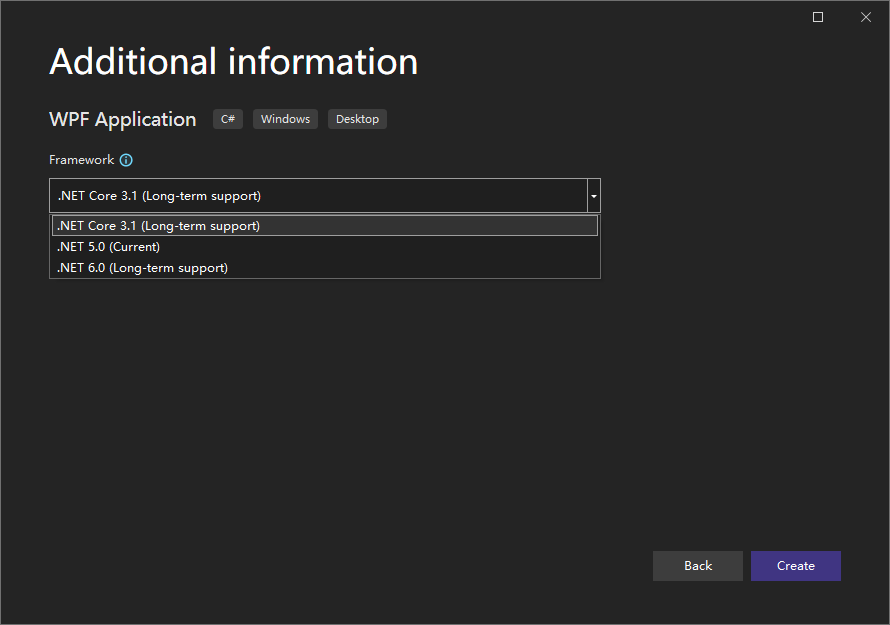
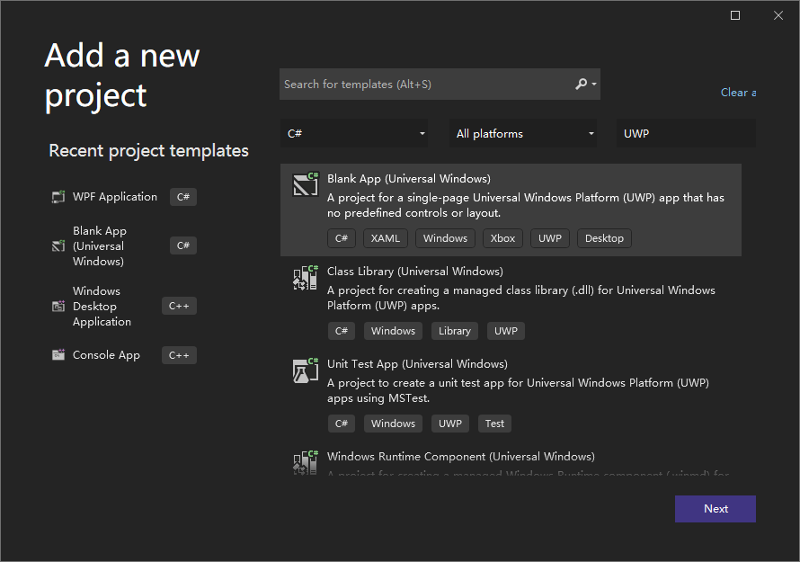
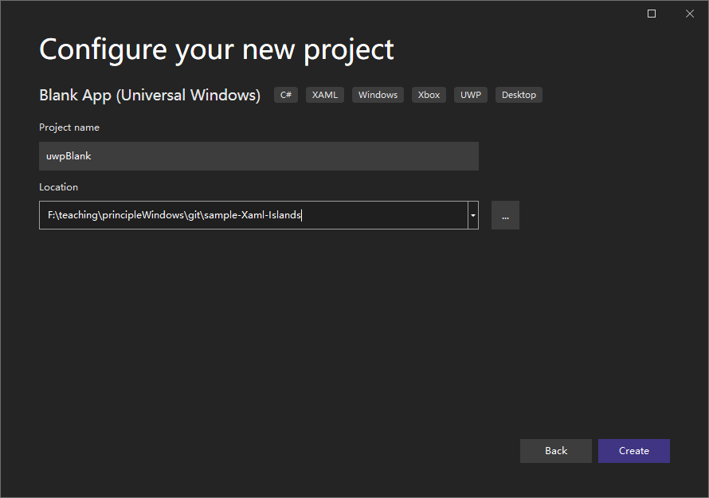
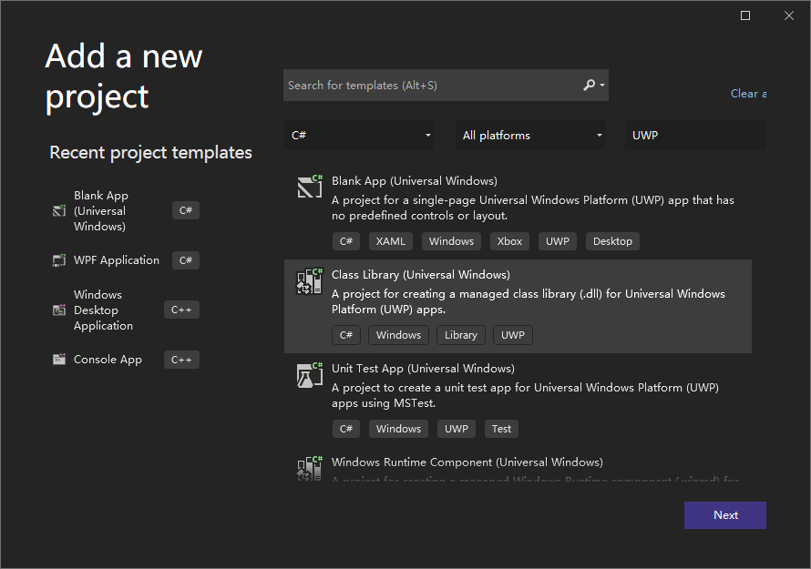
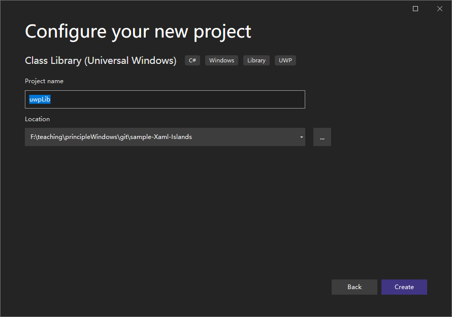

# XAML Islands Samples

1. [.NET Core学习笔记（2）―― WPF使用UWP Custom Control](https://www.cnblogs.com/manupstairs/p/12085084.html)


*******************************


在.NET Core 3.0中，可以在 WPF 中嵌入 UWP Custom Control。虽然是通过 WindowsXamlHost
来导入 Custom Control，但这意味着：

1. 我们可以创建一个独立的 UWP Control Library。在该Library中，和 UWP API 
的交互将不存在任何障碍。同时通过良好的封装，将类型转换的逻辑写在内部，对外仅暴露 WPF 
类型的情况下，可以有效的避免 UWP Control 和 WPF Control 同名的问题。在外部调用的 WPF 
程序看来，这就是一个纯的 WPF Control。

2. 因为 Style 和 Template 不再受到限制，对 UI 的控制力完全释放，我们甚至可以将整个页面放到 UWP 
Custom Control 中，制作一个完全使用 UWP Control 的 exe 程序。


## Step 1. Prerequisites


### 1.1 Install .NET Core 3.1 SDK

You must first install the latest version of the 
[.NET Core 3.1 SDK](https://dotnet.microsoft.com/en-us/download/dotnet/3.1) 
if you haven't done so already. 
也可以从 github 上下载，地址在
[.NET Home](https://github.com/dotnet/core)

查看版本
```batch
dotnet --info
```
<div align=center>

</div>

.NET Core 3.1 is an LTS release with support from Microsoft for the next three years. 


### 1.2 Create a new folder

新建文件夹 F:\teaching\principleWindows\git\sample-Xaml-Islands，
我们将在其中保存示例的资源及代码。


## Step 2. Create a WPF project

Before getting started, follow these instructions to create a WPF project and configure it to host 
XAML Islands. If you have an existing WPF project, you can adapt these steps and code examples for 
your project.

1. In Visual Studio 2022, create a new WPF App (.NET Core) project **wpfHost**.
    - Click File -> new Project, search for wpf, choose **WPF Application**, and click Next
    
<div align=center>

</div>

    - Set the project name to be **wpfHost**

<div align=center>

</div>

    - Select the framework to be **.NET Core 3.1 (Long-term support)**

<div align=center>

</div>

    - Click **Create** button

2. Install NuGet package **Microsoft.Toolkit.Wpf.UI.XamlHost**.

3. Install NuGet package **Microsoft.Toolkit.Wpf.UI.Controls**.
This package provides everything you need to use the wrapped WinRT XAML controls for WPF.

4. Configure  the solution to target x64. 
Most XAML Islands scenarios are not supported in projects that target Any CPU.


## Step 3. Create a blank UWP app project

Next, add a blank UWP app project to your solution. 

1. In Solution Explorer, right-click the solution node and select Add -> New Project.

2. Add a Blank App (Universal Windows) project **uwpBlank** to your solution. Make sure the target version 
and minimum version are both set to Windows 10, version 1903 (Build 18362) or a later release. Also make 
sure this new UWP project is not in a subfolder of the WPF project. Otherwise, the WPF app will later try 
to build the UWP XAML markup as if it were WPF XAML.
    
<div align=center>

</div>

    - Set the project name to be **uwpBlank**

<div align=center>

</div>

    - Click **Create** button

3. Install **Microsoft.Toolkit.Win32.UI.XamlApplication** NuGet package(latest stable version).

4. 对于这个空的UWP工程，我们仅需保留App.xml文件，将App的继承关系改为继承自XamlApplication对象。

    ```xml
    <xaml:XamlApplication
        x:Class="uwpBlank.App"
        xmlns="http://schemas.microsoft.com/winfx/2006/xaml/presentation"
        xmlns:x="http://schemas.microsoft.com/winfx/2006/xaml"
        xmlns:xaml="using:Microsoft.Toolkit.Win32.UI.XamlHost"
        xmlns:local="using:uwpBlank">
    </xaml:XamlApplication>
    ```

5. Open the **App.xaml.cs** file and replace the contents of this file with the following code. 

    ```csharp
    namespace uwpBlank
    {
        /// <summary>
        /// Provides application-specific behavior to supplement the default Application class.
        /// </summary>
        public sealed partial class App : Microsoft.Toolkit.Win32.UI.XamlHost.XamlApplication
        {
            /// <summary>
            /// Initializes the singleton application object.  This is the first line of authored code
            /// executed, and as such is the logical equivalent of main() or WinMain().
            /// </summary>
            public App()
            {
                this.Initialize();
            }
        }
    }
    ```

6. Delete the MainPage.xaml file from the UWP app project.

7. Build the UWP app project.


## Step 4. Create an UWP Custom Control Library


1. In Solution Explorer, right-click the solution node and select Add -> New Project.

2. Add a class library (Universal Windows) project **uwpLib** to your solution. Make sure the target version 
and minimum version are both set to Windows 10, version 1903 (Build 18362) or a later release. Also make 
sure this new UWP project is not in a subfolder of the WPF project. Otherwise, the WPF app will later try 
to build the UWP XAML markup as if it were WPF XAML.
    
<div align=center>

</div>

    - Set the project name to be **uwpLib**

<div align=center>

</div>


    - Click **Create** button
    - Make sure the target version and minimum version are both set to Windows 10, version 1903 (Build 18362) or a later release. 

3. Unload the uwpLib created above and edit the project file, add the following content at the bottom:

```xml
<!-- To modify your build process, add your task inside one of the targets below and uncomment it.
       Other similar extension points exist, see Microsoft.Common.targets.
  <Target Name="BeforeBuild">
  </Target>
  <Target Name="AfterBuild">
  </Target>
  -->
  <PropertyGroup>
    <EnableTypeInfoReflection>false</EnableTypeInfoReflection>
    <EnableXBindDiagnostics>false</EnableXBindDiagnostics>
  </PropertyGroup>
</Project>
```

    Save and reload the project.


### 4.1 Creating User Control

<https://social.technet.microsoft.com/wiki/contents/articles/32795.uwp-creating-user-control.aspx>

*****************************************

1. Add user control
    \
    Under Solution Explorer -> uwpLib -> Add -> New item -> User Control name it as "AutoSuggestEditBox" 
and press Add.

2. XAML
    \
    Drag and drop Controls in Design or you can write manually in XAML in Control.xaml file 
Draging TextBlock


### 4.2 How to Create and Use Custom Control in UWP

<https://www.codeproject.com/Tips/1061146/How-to-create-and-use-custom-control-in-UWP>

****************************


### 4.3 在 CustomControl 使用 xaml 写界面

<https://blog.csdn.net/lindexi_gd/article/details/103184570>

***************************************

在 UWP 主要的元素就是控件，可以说，整个 UWP 的界面都依靠控件画出来的。使用 xaml 可以快速画出好看的界面，
而默认创建的自定义控件和用户控件不一样，用户控件会带一个 xaml 直接修改就可以在设计器看到界面。

通过创建一个类继承 Control 类，这里创建的是一个 Board 类


## 5 wpf sample

[Host a custom WinRT XAML control in a WPF app using XAML Islands](https://docs.microsoft.com/en-us/windows/apps/desktop/modernize/host-custom-control-with-xaml-islands)


